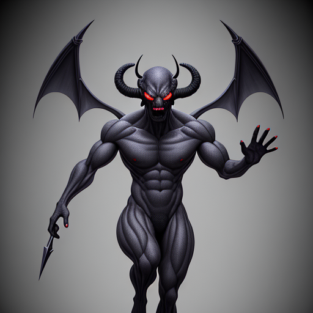
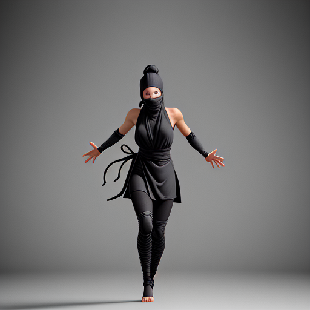
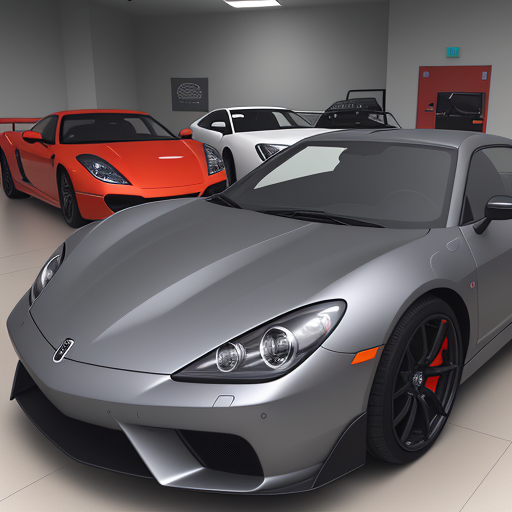

---

language:
- en
license: mit
tags:
- stable-diffusion
- stable-diffusion-diffusers
- text-to-image
- diffusers
inference: true
---

    

### OnnxStack
This model has been converted to ONNX and tested with OnnxStack

- [OnnxStack](https://github.com/saddam213/OnnxStack)

### LCM Dreamshaper V7 Diffusion
This model was converted to ONNX from LCM Dreamshaper V7

- [LCM-Dreamshaper-V7](https://huggingface.co/SimianLuo/LCM_Dreamshaper_v7)

### Sample Images
*A demon*

     Seed: 207582124     GuidanceScale: 7.5     NumInferenceSteps: 30

__________________________
*An angel*

     Seed: 207582124     GuidanceScale: 7.5     NumInferenceSteps: 30

__________________________
*A ninja*

     Seed: 207582124     GuidanceScale: 7.5     NumInferenceSteps: 30

__________________________
*a japanese dometic market sports car sitting in a showroom*

     Seed: 207582124     GuidanceScale: 7.5     NumInferenceSteps: 30

__________________________